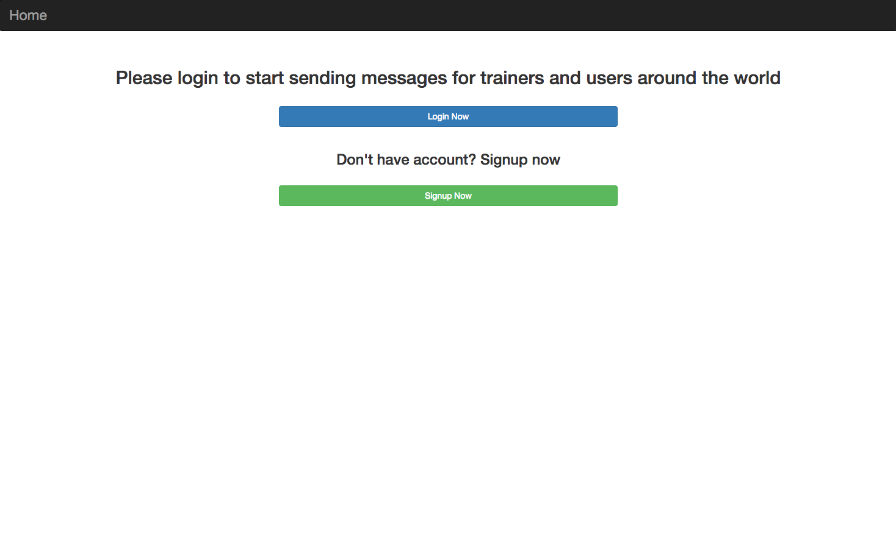
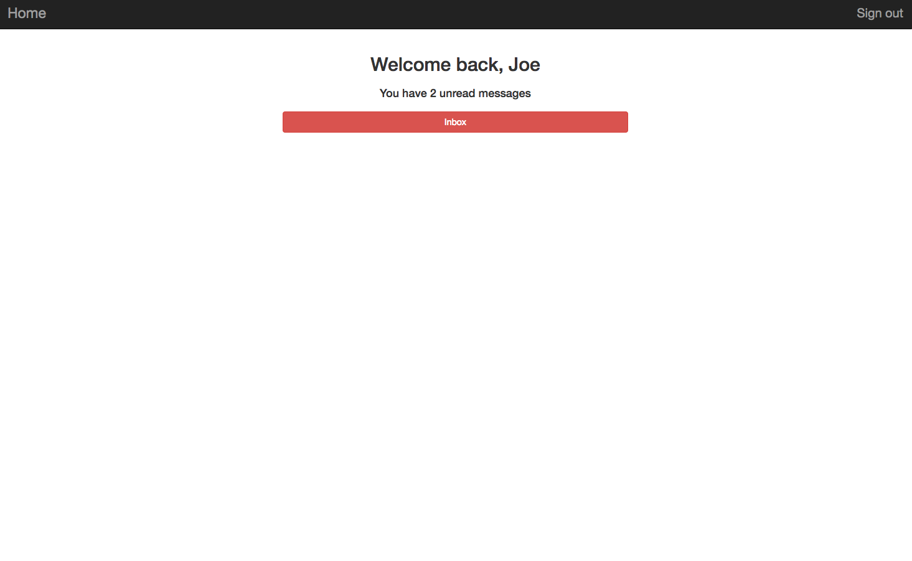
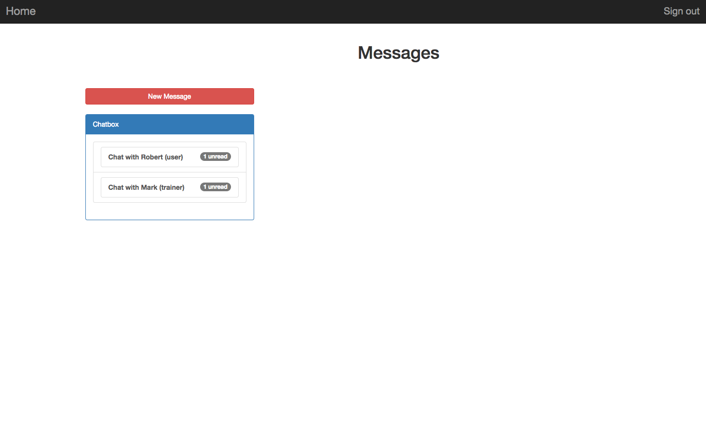
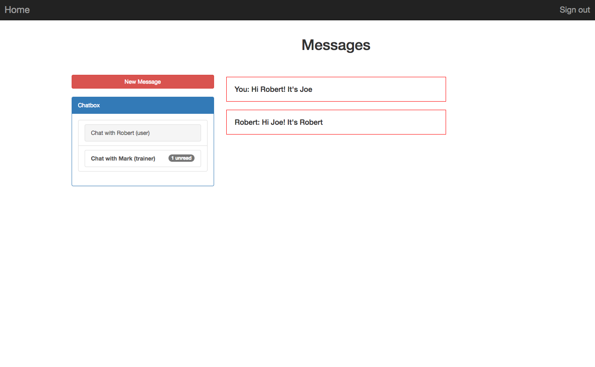

# Mail inbox app

Simple app that helps trainers and users all around the world register and send messages to each other.

# Technologies

+ Rails as back-end server, mostly acts as REST API
+ Angular 1 for front-end and navigation (with webpack for bundling)
+ Bootstrap for styling

# Installation

1. Clone the project
2. Change to project's directory
3. Run **bin/yarn** for front-end dependencies
4. Run **bin/bundle** for Rails depedencies
5. **bin/rails s** to start the server (please run in development mode since there might be many problems with production mode)
6. **Note**: If you want to run all test cases, there is a problem with fixtures file that cause all the test to fail.
It used to work perfectly. I haven't figured out the way to fix it yet

# Design

1. Angular-ui-router for navigation
2. Each link is treated as a separate component with a seperate controller

# Layouts

+ Front Page: Show unread messages, display user's name
+ Chat Page: Design is similar to a normal Email app, in which the conversations that have unread messages will be 
bold. Number of unread messages are also display. After clicking to the chat box, the conversation with that person is no longer bold
+ Signup, Signin and New Message pages: Cannot submit the form if validation fails

# What I've done

1. Authentication with permanent signed cookies
2. Form validation on posting new messages, signup, signin
3. Unit tests for models, controllers (mostly REST API test), some integration tests

# What I can improve

1. Verify authentication using email
2. Password reset functionality
3. Cookies with expiration
4. Code refactor (since I just learned Rails and Angular each one for a week so I cannot
apply best practices)
5. UI, UX redesign

# Demo

